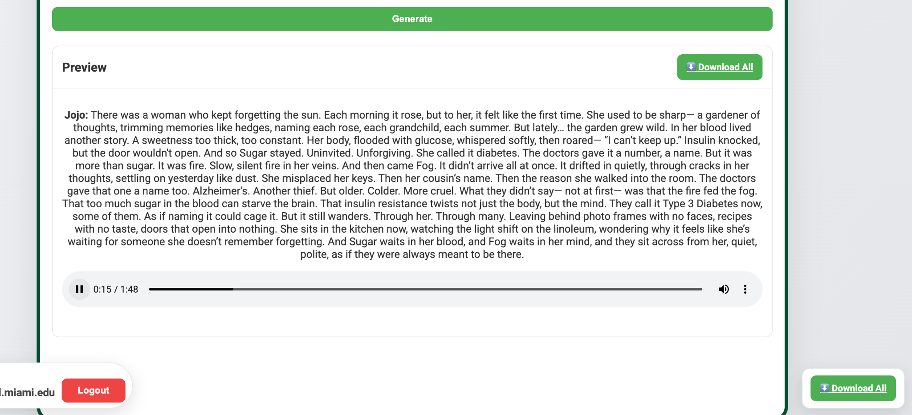

# Mindful Diabetes — Text-to-Speech (Showcase)

> Multi-voice TTS for short-form content, podcasts, and dialogue scripts.  
> Create reusable **character profiles**, generate **single or multi-speaker** audio, preview instantly, and download MP3s.  
> **This repo is a public showcase (docs + screenshots).** Production source and API keys remain private.

[Request Access](mailto:joey@dksmithandco.com) · [Features](#features) · [Screenshots](#screenshots) · [Quickstart](#quickstart) · [Workflows](#workflows) · [Assets](#assets) · [Security](#security--privacy) · [Roadmap](#roadmap) · [Contact](#contact)

---

## Overview
**Mindful Diabetes TTS** is a browser-based studio for generating natural-sounding voiceovers with **reusable character profiles** (name, language, region/accent, gender, voice #, speaking rate, optional avatar). You can run **single-voice** narration or **multi-speaker** dialogues by assigning speakers per line.

- **Voice catalog:** Backed by **Google Cloud Text-to-Speech**, offering a broad set of **English and Spanish** voices (plus other languages) with multiple **regional accents**.
- **Fast iteration:** Inline **preview** and **download** for each job; batch generation for longer scripts.
- **Simple outputs:** MP3 files (optional per-line or stitched). MP4 (talking-head) is in development.

---

## Features

### Character Library
- Create named **profiles** once; reuse across lines and projects.
- Set **language**, **region/accent**, **gender**, **voice #**, and **speaking rate**.
- Optional **avatar** metadata for downstream video workflows.

### Single & Multi-Speaker Modes
- **Single mode:** great for narration, shorts, reels, and podcasts.
- **Dialog mode:** assign **Speaker 1/2/…** per line using any saved profile (or ad-hoc settings).

### Voice Coverage (Google TTS)
- **English** (US/UK/AU/IN and more) and **Spanish** (US/ES/LatAm) accents highlighted.
- Neural voices when available; graceful fallback otherwise.

### Speed, Preview, and Downloads
- **Quick turnaround:** submit → synthesize → **inline preview** player.
- **Download MP3** (per-speaker or consolidated).
- **Batch jobs** for longer scripts (server-side queued).

### Coming Soon
- **MP4 Creation (Talking Heads):** Optional render route using DL/ML models (e.g., SadTalker-style) to produce social-ready video from your generated audio + avatar.

---

## Screenshots

**Login (approved users only)**  


**Character Library & voice controls**  


**Dialog setup (multi-speaker)**  


**Preview & downloads**  



---

## Quickstart

1. **Create a Character**  
   Go to **Character Library → Name** your profile (e.g., “Jojo”).  
   Choose **Language → Region/Accent → Gender → Voice #**.  
   Adjust **Speaking rate** and **Save/Update Profile**.

2. **Choose Mode**  
   - **Single:** paste your script and select the profile to narrate all lines.  
   - **Dialog:** add **Speaker 1/2/…** blocks; pick a profile per speaker and paste each speaker’s lines.

3. **Generate**  
   Click **Test Voice** for a short sample, or **Generate** to synthesize the full job.  
   Use the **Preview player** to review; click **Download** to save MP3s.

> Tip: For multilingual content, keep separate profiles per accent (e.g., `Jojo_EN_US`, `Jojo_ES_MX`).

---

## Workflows

### A) YouTube/TikTok Shorts
- Single mode → one narrator profile → generate → download MP3.
- (Soon) Send to **MP4 talking-head** route for auto-video.

### B) Podcast Intros/Outros
- Build a “House Voice” profile; keep a slightly slower speaking rate.
- Generate intro/outro once; reuse across episodes.

### C) Dialogues / Skits
- Create a profile per character (e.g., “Nurse_Ana_ES-MX”, “Doc_Sam_EN-US”).
- Use **Dialog mode** to assign speakers line-by-line.
- Generate, preview, and download separate tracks or a stitched file.

---

## Assets
Place these in `./assets/`:

- `md-tts-login.png` — Login modal (approved users)
- `md-tts-builder.png` — Character Library & controls
- `md-tts-dialog.png` — Multi-speaker dialog editor
- `md-tts-preview.png` — Preview player + downloads

(Alt text and captions are enumerated in the **Screenshots** section.)

---

## Implementation Notes (Showcase-level)

- **Frontend:** HTML+JS with server-rendered updates (HTMX-style interactions).  
- **Backend:** Flask / Python; job queue for longer renders.  
- **Voices:** Google Cloud Text-to-Speech (neural where supported).  
- **Outputs:** MP3 (per-speaker and/or stitched). MP4 route under development.

**Example profile JSON (conceptual):**
```json
{
  "name": "Jojo",
  "language": "en",
  "region": "US",
  "gender": "MALE",
  "voice": "en-US-Standard-J",
  "rate": 1.0,
  "avatar": "none"
}
```

**Example dialog payload (conceptual):**
```json
{
  "mode": "dialog",
  "lines": [
    { "speaker": "Jojo", "text": "There was a woman who kept forgetting the sun." },
    { "speaker": "Ana_ES_MX", "text": "Pero aún recordaba el jardín y cada verano." }
  ]
}
```

---

## Security & Privacy
- **Keys:** TTS provider keys are **server-side only** (never exposed to the browser).  
- **Access:** Login is **invite-only**. Sessions capped per user (to prevent sharing/abuse).  
- **Data:** Text you paste is processed solely to synthesize audio and generate previews; audio files are served back for download and may be auto-deleted on a retention schedule.  
- **Attribution:** Voice output complies with the terms of the underlying TTS provider. You are responsible for usage in your projects.

---

## Roadmap
- **Talking-Head MP4 render** (avatars + DL/ML lip-sync; export for shorts/reels)  
- **SSML support** (fine-grained prosody, breaks, emphasis)  
- **Project folders + history**  
- **Per-line SFX/music stitching**  
- **Batch import (CSV/JSON) for large dialog sets**

---

## Contact
Questions, access requests, or pilots: **joey@dksmithandco.com**
